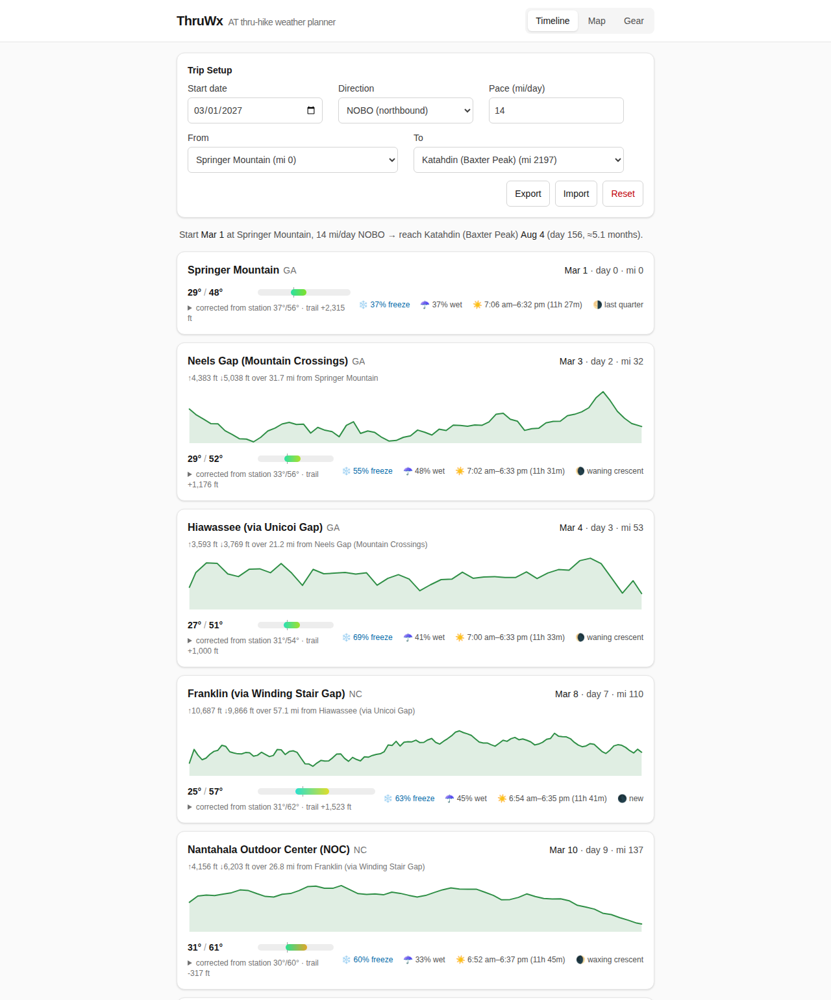
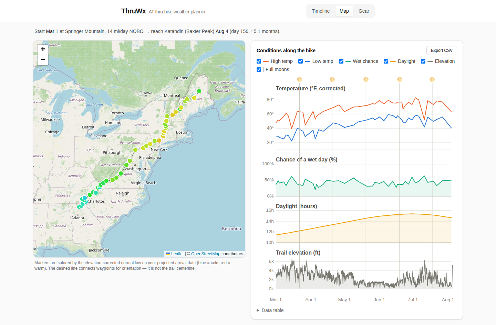
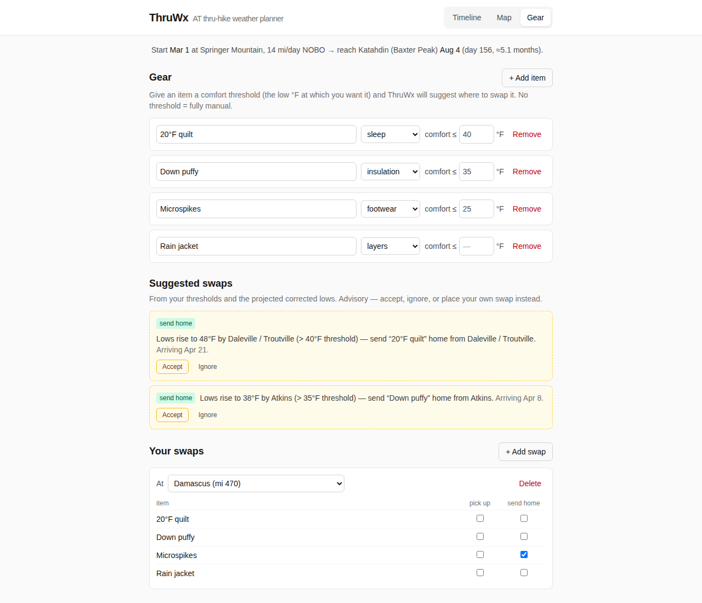
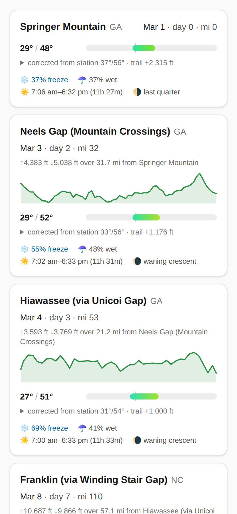

# ThruWx

Weather + gear planning for Appalachian Trail thru-hikers.

Given a start date, direction (NOBO or SOBO), and pace, ThruWx projects where
you'll be on every date of a thru-hike or of a section between any two
waypoints, and shows the **typical weather** you can expect there —
1991–2020 historical climate normals, corrected from each weather station's
elevation to the trail's elevation (~3.5°F colder per 1,000 ft of ridge above
the valley station). Daylight, moon phase, and
threshold-based gear-swap suggestions ride along.

**These are historical typical conditions, not a forecast.** Nobody can
forecast a date four months out; normals are the honest planning number.

## Screenshots

**Timeline**: every waypoint on its projected arrival date, with corrected
temperatures, freeze and rain odds, daylight, moon, and the elevation profile
of the leg walked to get there.



**Map**: waypoints colored by the expected low on arrival, beside the
conditions chart (temperature, wet-day chance, daylight, and trail elevation
across the hike).



**Gear**: swap suggestions from each item's comfort threshold, alongside the
swaps you've planned.



**Phone**



## Architecture

No backend. No runtime API calls. No accounts.

```
Build time:  scripts/build-climate.ts  --ACIS-->      src/data/climate.json
             scripts/build-profile.ts  --OSM+3DEP-->  src/data/profile.json
Static data: src/data/waypoints.json   (hand-curated, 43 waypoints)
Runtime:     React SPA, all math in-browser, plan persists to localStorage.
```

The climate dataset is static because normals change once a decade. The React
app loads three JSON files and computes everything else (projection, elevation
correction, sun/moon, suggestions) as pure functions in `src/domain/`.

## Commands

```
npm run dev            # Vite dev server
npm run build          # production build → dist/
npm run test           # Vitest (domain logic + data validation)
npm run build:climate  # regenerate climate.json from RCC-ACIS (rarely needed)
npm run build:profile  # regenerate profile.json (trail elevation) from OSM + USGS 3DEP
npm run screenshots    # regenerate docs/screenshots/ from a demo plan
                       #   (one-time: sudo npx playwright install-deps chromium)
npx tsx scripts/assign-stations.ts   # re-assign ACIS stations to waypoints
```

## Deploying

`npm run build` produces a fully static `dist/` — any static host works,
zero config (single-page, no client-side routing, no rewrites needed):

- **Netlify / Vercel / Cloudflare Pages**: connect the repo; build command
  `npm run build`, output directory `dist`.
- **Anything else**: copy `dist/` to the web root.

## Data notes

See `docs/PHASE0_DATA_NOTES.md` for the full data decisions: the normals
methodology (computed from ~30 years of raw ACIS dailies, "M"/"T" handling,
leap-day convention), station-assignment rules (stations must be ≤10% missing
within 1991–2020 — period-of-record alone lies), known station-coverage gaps
(southern Vermont, the 100-Mile Wilderness), and elevation sourcing (USGS 3DEP,
public domain).

Weather data: NOAA, via RCC-ACIS web services. Elevations: USGS 3DEP. Trail
line for the elevation profile: © OpenStreetMap contributors (ODbL); see
Decision 3 in the data notes.
